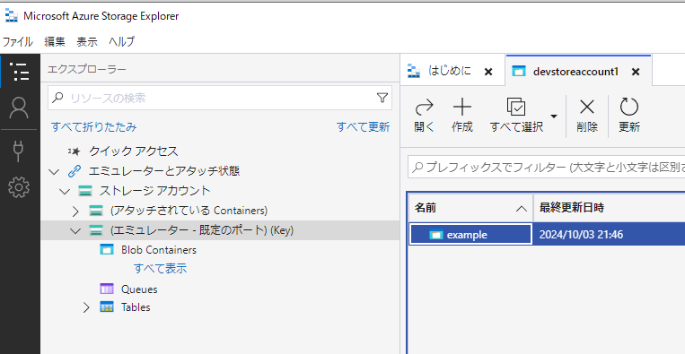
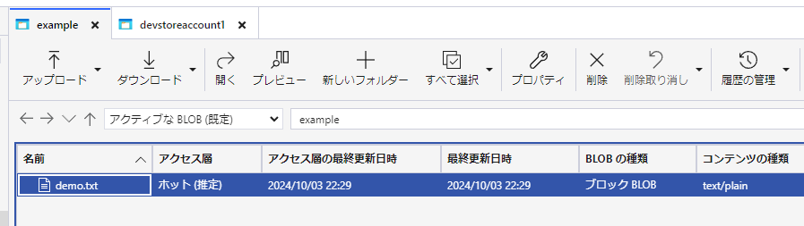
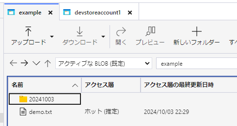
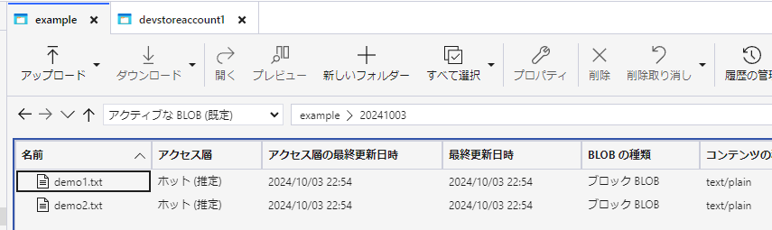
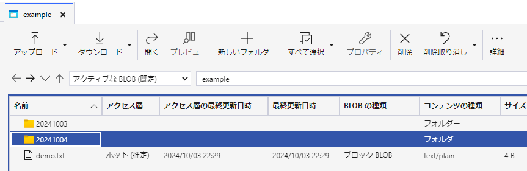
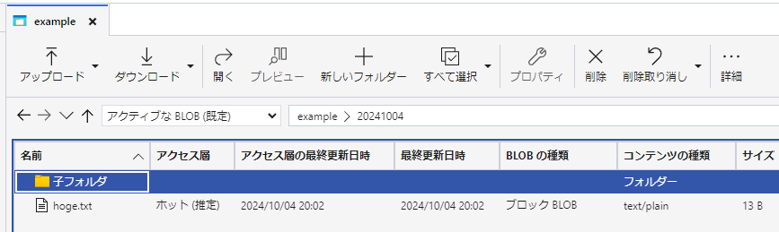
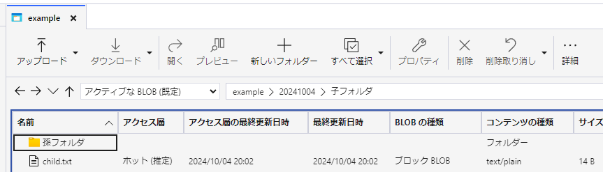
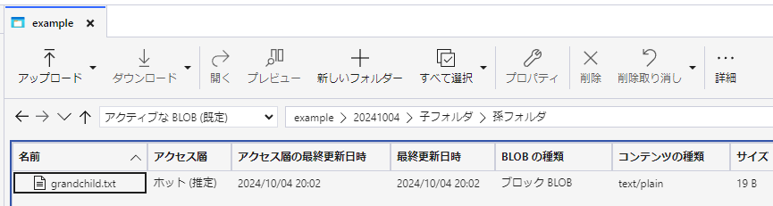

# docker-azurite-study
- [azurite](https://learn.microsoft.com/ja-jp/azure/storage/common/storage-use-azurite?tabs=visual-studio%2Cblob-storage) についてDockerコンテナを利用した環境構築を試したときのメモ
- Azure歴2日とかなので間違ってること書いていることがあるかもしれない。。（；o；

## 参考サイト（Blob コンテナ関連）
- [ローカルでの Azure Storage の開発に Azurite エミュレーターを使用する | Microsoft Learn](https://learn.microsoft.com/ja-jp/azure/storage/common/storage-use-azurite?tabs=docker-hub%2Cblob-storage)
  - 公式のドキュメント（Dockerを利用しないケースの情報も含む）
  - azure-cli コンテナからの az コマンドを使用したストレージ操作の際の `ストレージアカウント` や `アカウントキー` についても[同記事内](https://learn.microsoft.com/ja-jp/azure/storage/common/storage-use-azurite?tabs=docker-hub%2Cblob-storage#well-known-storage-account-and-key)に記載がある
  - これは azurite を Docker で使う場合に限った話ではないが、コンテナ内から同一ネットワークの azurite コンテナ内(例としてBLOBコンテナ)にアクセスするには `http://azurite:10000/` のようなアクセスをする必要がある
  - 開発用の接続文字列として `UseDevelopmentStorage=true` という設定も存在するが、これは `http://localhost:10000` のような接続を想定したもの。azure-cli コンテナから azurite コンテナを操作したいといったケースの場合、長い接続文字列を指定する必要があるみたい（後述）
    - Makefile内にもハードコートしているが以下のKeyValueペア情報をセミコロンで繋げた文字列をconnection-stringオプションで渡すことになる
- [Azure Storage Explorer – クラウド ストレージ管理 | Microsoft Azure](https://azure.microsoft.com/ja-jp/products/storage/storage-explorer)
  - CLIからのコマンド操作のみでストレージを操作するのはさすがに大変なので上記のソフトウェアをインストールすると何かと便利（Microsoft公式）
    - `今回は azure-cli コンテナからのCLI操作の実行結果の確認用途でのみ使用`
  - このソフトウェアはWindowsなどDockerの外にインストール＆実行するもの。当然だがBlobストレージなどの接続文字列は↑に記載したものとは異なる点は注意
  - 2024/10現在、このソフトウェアは実行するのに`.NET 8`が必要な様子
    - Azure Storage Explorerのインストーラ起動時に併せてインストールすることが可能
- [az storage | Microsoft Learn](https://learn.microsoft.com/ja-jp/cli/azure/storage?view=azure-cli-latest)
  - Azure CLIの各コマンドについての解説が載っているページ（公式）
  - 左側のツリー構造は日本語翻訳が混じって読みづらいことになっているので[英語の同ページ](https://learn.microsoft.com/en-us/cli/azure/storage?view=azure-cli-latest)も併せてみると便利

azurite 接続文字列情報（以下KeyValueのうち必要なものを連結したものをconnection-stringオプションでセットする）
|key|value|必須or任意|
|---|---|---|
|DefaultEndpointsProtocol|http|必須|
|AccountName|devstoreaccount1|必須|
|AccountKey|Eby8vdM02xNOcqFlqUwJPLlmEtlCDXJ1OUzFT50uSRZ6IFsuFq2UVErCz4I6tq/K1SZFPTOtr/KBHBeksoGMGw==|必須|
|BlobEndpoint|http://azurite:10000/devstoreaccount1|任意|
|QueueEndpoint|http://azurite:10001/devstoreaccount1|任意|
|TableEndpoint|http://azurite:10002/devstoreaccount1|任意|

## 参考サイト（テーブル ストレージ関連）
- [テーブル ストレージの概要 - Azure のオブジェクト ストレージ | Microsoft Learn](https://learn.microsoft.com/ja-jp/azure/storage/tables/table-storage-overview)
  - テーブルストレージに関するドキュメント
  - テーブルアカウント、テーブル、エンティティといったテーブルストレージを構成する要素について理解するのに必要となる情報がまとまっている
- [az storage table | Microsoft Learn](https://learn.microsoft.com/ja-jp/cli/azure/storage/table?view=azure-cli-latest)
  - テーブルストレージのテーブルを azure-cli から扱う際のコマンドに関するドキュメント
  - `AZURE_STORAGE_CONNECTION_STRING` 環境変数に関する情報もこのページ内あった
- [az storage entity | Microsoft Learn](https://learn.microsoft.com/ja-jp/cli/azure/storage/entity?view=azure-cli-latest)
  - テーブルストレージのエンティティを azure-cli から扱う際のコマンドに関するドキュメント
  - エンティティというのはテーブル内に含まれるレコードのこと
  - AWSのDynamoDBと比べるとTTLに関する設定などは存在しないみたい？

## Makefileの各ターゲットについて
### init
- 勉強用のコンテナ環境を起動する
- 実行後、azure-cliとazuriteの2コンテナが起動状態にあれば正常

```bash
> docker ps
CONTAINER ID   IMAGE                                     COMMAND                  CREATED          STATUS          PORTS                                  NAMES
8b887d2fbdbb   mcr.microsoft.com/azure-cli               "/bin/sh -c bash"        40 seconds ago   Up 36 seconds                                          docker-azurite-study-azure-cli-1
72c7f59c3475   mcr.microsoft.com/azure-storage/azurite   "docker-entrypoint.s…"   40 seconds ago   Up 36 seconds   0.0.0.0:10000-10002->10000-10002/tcp   docker-azurite-study-azurite-1
```

### create_blob_container
- Blobストレージに example という名前のBlobコンテナを作成する
- 実行後に`{ "created": true }`という出力が得られれば正常(ちなみに2度目の実行では既にBlobコンテナが存在するため`{ "created": false }`となる)

```bash
> make create_blob_container
docker compose exec azure-cli az storage container create \
                --name example \
                --connection-string 'DefaultEndpointsProtocol=http;AccountName=devstoreaccount1;AccountKey=Eby8vdM02xNOcqFlqUwJPLlmEtlCDXJ1OUzFT50uSRZ6IFsuFq2UVErCz4I6tq/K1SZFPTOtr/KBHBeksoGMGw==;BlobEndpoint=http://azurite:10000/devstoreaccount1;'
{
  "created": true
}
```

- このコマンドを実行後、Azure Storage Explorer でdevstoaccount1のBlob Containersを選択すると example というBlobコンテナが閲覧できるはず。



### upload_file
- 1ファイルをBlobコンテナにアップロードする
- 以下のような出力が得られれば正常
- `azure-cliコンテナにホスト側に存在するexamplesディレクトリを/examplesというパスでマウントしている`

```bash
> make upload_file
docker compose exec azure-cli az storage blob upload \
                --connection-string 'DefaultEndpointsProtocol=http;AccountName=devstoreaccount1;AccountKey=Eby8vdM02xNOcqFlqUwJPLlmEtlCDXJ1OUzFT50uSRZ6IFsuFq2UVErCz4I6tq/K1SZFPTOtr/KBHBeksoGMGw==;BlobEndpoint=http://azurite:10000/devstoreaccount1;' \
                --container-name example \
                --file '/examples/demo.txt'
Finished[#############################################################]  100.0000%
{
  "client_request_id": "76d8f544-818b-11ef-8989-0242ac180002",
  "content_md5": "/gHOKn+6yPr67XyYKgTiKQ==",
  "date": "2024-10-03T13:29:06+00:00",
  "encryption_key_sha256": null,
  "encryption_scope": null,
  "etag": "\"0x1E42F7CF57B49A0\"",
  "lastModified": "2024-10-03T13:29:06+00:00",
  "request_id": "8cb3f27c-8c00-4873-9635-38e8589eb2c1",
  "request_server_encrypted": true,
  "version": "2024-11-04",
  "version_id": null
}
```



## upload_folder
- `--source`で指定したパス内に含まれるファイル一式を`--destination`で指定したパス内にアップロードする
- `--destination`はblobコンテナ名を先頭として存在しないパスを記載してもOK(フォルダとして作成される)
- 以下のような出力が得られれば正常

```bash
> make upload_folder
docker compose exec azure-cli az storage blob upload-batch \
                --connection-string 'DefaultEndpointsProtocol=http;AccountName=devstoreaccount1;AccountKey=Eby8vdM02xNOcqFlqUwJPLlmEtlCDXJ1OUzFT50uSRZ6IFsuFq2UVErCz4I6tq/K1SZFPTOtr/KBHBeksoGMGw==;BlobEndpoint=http://azurite:10000/devstoreaccount1;' \
                --destination example/20241003 \
                --source '/examples/20241003'
Finished[#############################################################]  100.0000%
[
  {
    "Blob": "http://azurite:10000/devstoreaccount1/example/20241003/demo1.txt",
    "Last Modified": "2024-10-03T13:54:50+00:00",
    "Type": "text/plain",
    "eTag": "\"0x22FDC63AE5E7700\""
  },
  {
    "Blob": "http://azurite:10000/devstoreaccount1/example/20241003/demo2.txt",
    "Last Modified": "2024-10-03T13:54:50+00:00",
    "Type": "text/plain",
    "eTag": "\"0x1C55803129B0C60\""
  }
]
```





- `blob upload-batchコマンドではアップロード元のフォルダ構造を維持できないという情報を見かけた。。(リンクは伏す。次のupload_folder_deepターゲットで検証)`

### upload_folder_deep
- upload_folder ターゲットの検証から少し発展させ`--source`で指定したパス内に子フォルダや孫フォルダが存在する状態で前回と同じような`blob upload-batch`コマンドによるアップロードを実施
- ついでにフォルダ名について日本語を使ってみる
- 以下のような出力が得られた

```bash
> make upload_folder_deep
docker compose exec azure-cli az storage blob upload-batch \
                --connection-string 'DefaultEndpointsProtocol=http;AccountName=devstoreaccount1;AccountKey=Eby8vdM02xNOcqFlqUwJPLlmEtlCDXJ1OUzFT50uSRZ6IFsuFq2UVErCz4I6tq/K1SZFPTOtr/KBHBeksoGMGw==;BlobEndpoint=http://azurite:10000/devstoreaccount1;' \
                --destination example/20241004 \
                --source '/examples/20241004'
Finished[#############################################################]  100.0000% 100.0000%
[
  {
    "Blob": "http://azurite:10000/devstoreaccount1/example/20241004/hoge.txt",
    "Last Modified": "2024-10-04T11:02:46+00:00",
    "Type": "text/plain",
    "eTag": "\"0x1E050A265770AF0\""
  },
  {
    "Blob": "http://azurite:10000/devstoreaccount1/example/20241004/%E5%AD%90%E3%83%95%E3%82%A9%E3%83%AB%E3%83%80/child.txt",
    "Last Modified": "2024-10-04T11:02:46+00:00",
    "Type": "text/plain",
    "eTag": "\"0x20E84D1D629CE00\""
  },
  {
    "Blob": "http://azurite:10000/devstoreaccount1/example/20241004/%E5%AD%90%E3%83%95%E3%82%A9%E3%83%AB%E3%83%80/%E5%AD%AB%E3%83%95%E3%82%A9%E3%83%AB%E3%83%80/grandchild.txt",
    "Last Modified": "2024-10-04T11:02:46+00:00",
    "Type": "text/plain",
    "eTag": "\"0x24CADB48678BE40\""
  }
]
```









- `孫フォルダを含む全てのディレクトリ構造を維持したアップロードが行えることを確認できた!これは便利(^o^)`

### delete_blob_container
- 作成したblobコンテナを削除する
- azuriteでの動作確認においては中にファイルが残っていようがこれといった確認なしで削除できた(本番がどうかは不明)
- 実行後に`{ "deleted": true }`という出力が得られれば正常(ちなみに2度目の実行では既にBlobコンテナが存在しないため`{ "deleted": false }`となる)

```bash
> make delete_blob_container
docker compose exec azure-cli az storage container delete \
                --name example \
                --connection-string 'DefaultEndpointsProtocol=http;AccountName=devstoreaccount1;AccountKey=Eby8vdM02xNOcqFlqUwJPLlmEtlCDXJ1OUzFT50uSRZ6IFsuFq2UVErCz4I6tq/K1SZFPTOtr/KBHBeksoGMGw==;BlobEndpoint=http://azurite:10000/devstoreaccount1;'
{
  "deleted": true
}
```

### create_table_storage_table
- テーブルストレージに mytable という名前のテーブルを作成する
- 実行後に`{ "created": true }`という出力が得られれば正常
- Blobコンテナの作成と異なりテーブルが存在する状態で再実行した場合も`{ "created": true }`となるみたい？

```bash
> make create_table_storage_table
docker compose exec azure-cli az storage table create \
                --name mytable \
                --connection-string 'DefaultEndpointsProtocol=http;AccountName=devstoreaccount1;AccountKey=Eby8vdM02xNOcqFlqUwJPLlmEtlCDXJ1OUzFT50uSRZ6IFsuFq2UVErCz4I6tq/K1SZFPTOtr/KBHBeksoGMGw==;TableEndpoint=http://azurite:10002/devstoreaccount1;'
{
  "created": true
}
```

### list_table_storage_tables
- テーブルストレージに作成済みのテーブル一覧を取得する

```bash
> make list_table_storage_tables
docker compose exec azure-cli az storage table list \
                --connection-string 'DefaultEndpointsProtocol=http;AccountName=devstoreaccount1;AccountKey=Eby8vdM02xNOcqFlqUwJPLlmEtlCDXJ1OUzFT50uSRZ6IFsuFq2UVErCz4I6tq/K1SZFPTOtr/KBHBeksoGMGw==;TableEndpoint=http://azurite:10002/devstoreaccount1;'
[
  {
    "name": "mytable"
  }
]
```

### insert_table_storage_entity
- テーブルストレージに作成した mytable テーブルにエンティティ(レコード)を作成する
- `PartitionKey` と` RowKey` の組み合わせで一意な値となる必要がある
- `--if-exists` オプションの設定によってテーブル内に PartitionKey と RowKey の組み合わせが存在する場合の動作を変更できる
  - fail: エラーになる(`The specified entity already exists.`というエラー出力が返ってくる、`省略時の規定値`)
  - merge: マージする(同じキーの登録があったら上書きする)
  - replace: リプレイスする(丸ごと後から送ったエンティティ情報で置き換える)

```bash
> make insert_table_storage_entity
docker compose exec azure-cli az storage entity insert \
                --table-name mytable \
                --if-exists merge \
                --entity PartitionKey=AAA RowKey=BBB Content=TestData CurrentTime=1728797654 \
                --connection-string 'DefaultEndpointsProtocol=http;AccountName=devstoreaccount1;AccountKey=Eby8vdM02xNOcqFlqUwJPLlmEtlCDXJ1OUzFT50uSRZ6IFsuFq2UVErCz4I6tq/K1SZFPTOtr/KBHBeksoGMGw==;TableEndpoint=http://azurite:10002/devstoreaccount1;'
{
  "content": {
    "Content": "TestData",
    "CurrentTime": 1728797654,
    "PartitionKey": "AAA",
    "RowKey": "BBB",
    "Timestamp": "2024-10-13T05:39:21.0824619Z",
    "odata.etag": "W/\"datetime'2024-10-13T05%3A39%3A21.0824619Z'\"",
    "odata.metadata": "http://azurite:10002/devstoreaccount1/$metadata#mytable/@Element"
  },
  "date": "2024-10-13T05:39:21+00:00",
  "etag": "W/\"datetime'2024-10-13T05%3A39%3A21.0824619Z'\"",
  "preference_applied": "return-content",
  "version": "2024-11-04"
}
```

### list_table_storage_mytable_entities
- テーブルストレージに作成した mytable テーブルに登録されているエンティティの一覧を取得する

```bash
> make list_table_storage_mytable_entities
docker compose exec azure-cli az storage entity query \
                --table-name mytable \
                --connection-string 'DefaultEndpointsProtocol=http;AccountName=devstoreaccount1;AccountKey=Eby8vdM02xNOcqFlqUwJPLlmEtlCDXJ1OUzFT50uSRZ6IFsuFq2UVErCz4I6tq/K1SZFPTOtr/KBHBeksoGMGw==;TableEndpoint=http://azurite:10002/devstoreaccount1;'
{
  "items": [
    {
      "Content": "TestData2",
      "CurrentTime": 1728797654,
      "PartitionKey": "AAA",
      "RowKey": "BBB",
      "Timestamp": "2024-10-13T05:44:31.992371+00:00",
      "etag": "W/\"datetime'2024-10-13T05%3A44%3A31.9923713Z'\""
    }
  ],
  "nextMarker": {}
}
```

### delete_table_storage_table
- テーブルストレージに作成した mytable テーブルを削除する
- 実行後に`{ "deleted": true }`という出力が得られれば正常(ちなみに2度目の実行では既にテーブルが存在しないため`{ "deleted": false }`となる)

```bash
> make delete_table_storage_table
docker compose exec azure-cli az storage table delete \
                --name mytable \
                --connection-string 'DefaultEndpointsProtocol=http;AccountName=devstoreaccount1;AccountKey=Eby8vdM02xNOcqFlqUwJPLlmEtlCDXJ1OUzFT50uSRZ6IFsuFq2UVErCz4I6tq/K1SZFPTOtr/KBHBeksoGMGw==;TableEndpoint=http://azurite:10002/devstoreaccount1;'
{
  "deleted": true
}
```

### send_connection_string_via_env
- ドキュメントに記載の `AZURE_STORAGE_CONNECTION_STRING` 環境変数で接続文字列を渡すことで `--connection-string` オプションによる設定を行わずにコマンドが実行可能なことを確認
- 例としてテーブルストレージに作成済みのテーブル一覧を取得する

```bash
> make send_connection_string_via_env
docker compose exec -e AZURE_STORAGE_CONNECTION_STRING='DefaultEndpointsProtocol=http;AccountName=devstoreaccount1;AccountKey=Eby8vdM02xNOcqFlqUwJPLlmEtlCDXJ1OUzFT50uSRZ6IFsuFq2UVErCz4I6tq/K1SZFPTOtr/KBHBeksoGMGw==;TableEndpoint=http://azurite:10002/devstoreaccount1;' azure-cli az storage table list
[
  {
    "name": "mytable"
  }
]
```